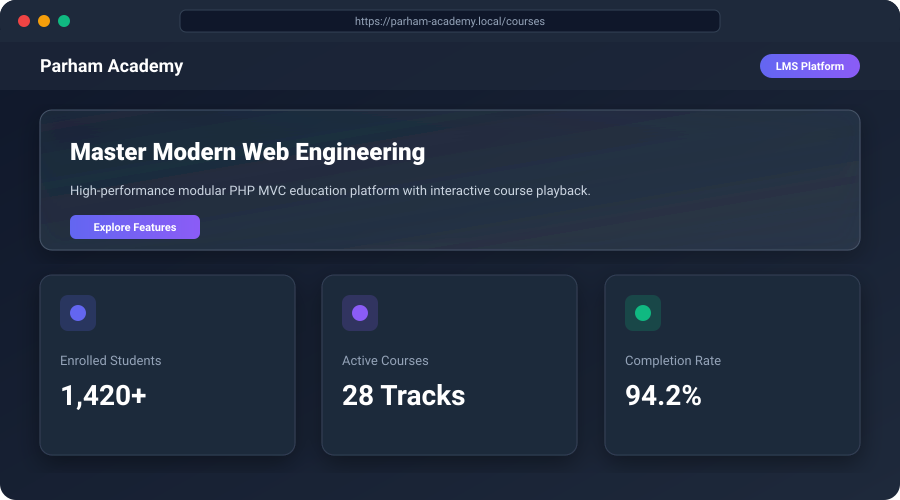
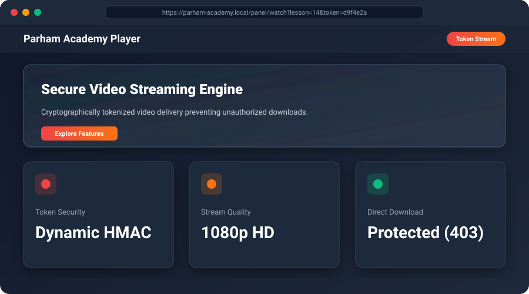
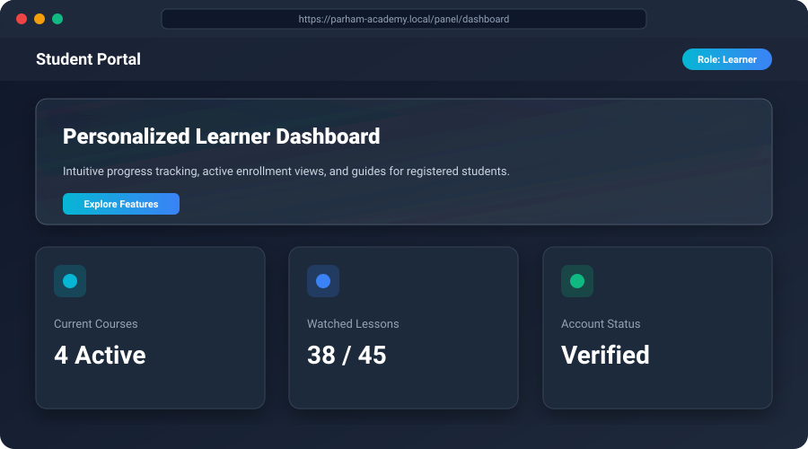
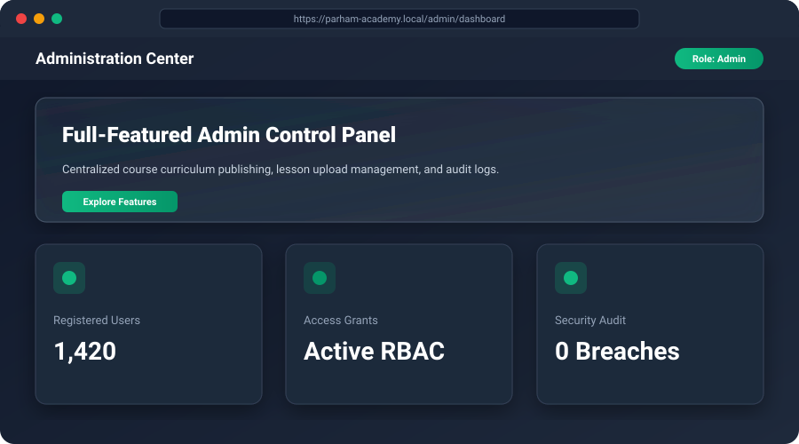

<div align="center">

# 🎓 Parham Academy - Learning Management System (LMS)

**An enterprise-ready, modular PHP MVC e-learning web platform engineered with secure video streaming tokens, granular course access control (RBAC), and comprehensive security logging.**

[](#)
[](#)
[](#)
[](#)
[](#)

</div>

---

## 🌐 Live Demo & Quick Access

- **Public Storefront / Courses:** `http://localhost/parham-academy/public`
- **Student Dashboard:** `http://localhost/parham-academy/public/panel/dashboard`
- **Admin Management Panel:** `http://localhost/parham-academy/public/admin/dashboard`

> **Demo Evaluation Credentials:**
> - **Administrator:** Username: `admin` | Password: `password123`
> - **Student Demo:** Username: `student` | Password: `password123`

---

## 📸 System Showcase & Screenshots

| 🏠 Course Catalog & Homepage | 🎥 Token-Protected Video Stream |
|:---:|:---:|
|  |  |
| **Learner Dashboard** | **Administration Center** |
|  |  |

---

## ⚡ Core Technical Features

- **Custom-Built PHP MVC Framework:** Zero third-party bloat. Employs clean separation of concerns with an extensible HTTP router, controller layer, and encapsulated PDO database wrapper.
- **Anti-Leech Video Stream Engine (`Videotoken`):** Lessons are guarded against direct URL grabbing via time-expiring cryptographic HMAC tokens. Unauthenticated direct requests receive strict HTTP 403 Forbidden.
- **Role-Based Access Control (RBAC):** Distinct permission layers separating Guests, Enrolled Students, and Administrators via normalized SQL tables (`course_access`, `v_active_access`).
- **Brute-Force & Rate-Limit Protection:** Real-time throttling via `login_attempts` tracking to neutralize automated credential stuffing.
- **Audit Logging:** Administrative actions, logins, and permission changes are persisted in `activity_log` for compliance and forensic tracking.
- **Responsive Interface:** Lightweight mobile-first CSS architecture with fluid typography and dark-mode aesthetic.

---

## 🛠️ Tech Stack

| Domain | Technology / Specification |
|:---|:---|
| **Backend Language** | PHP 8.0+ (Strict typing, Object-Oriented Programming, MVC) |
| **Database** | MySQL / MariaDB (Prepared Statements, Foreign Keys, SQL Views) |
| **Security Layer** | Dynamic HMAC Tokenizer, Password Hashing (`PASSWORD_BCRYPT`), Session Guard |
| **Frontend** | Semantic HTML5, Modern CSS3 (Flexbox/Grid), Vanilla JavaScript (ES6+) |
| **Web Server** | Apache (URL Rewriting via `.htaccess` Front-Controller) |

---

## 🏛️ System Architecture

```text
HTTP Request (Browser)
       │
       ▼
[ public/index.php ] ──────► [ app/bootstrap.php ] (Autoload, Config, Session)
       │
       ▼
 [ app/core/Router.php ] (Regex-based URI matching & Middleware)
       │
       ├─────────────────────────────────┐
       ▼                                 ▼
[ Controllers / Logic ]          [ Security Guard ]
(AdminController, VideoController)  (Auth, Access, Videotoken)
       │                                 │
       ├─────────────────────────────────┘
       ▼
 [ Database / Models ] (PDO Prepared Queries against `parham_academy.sql`)
       │
       ▼
  [ Views / Layouts ] (Main layout, Student panel, Admin templates)
       │
       ▼
HTTP Response (HTML / Streamed Media)
```

---

## 📂 Project Structure

```text
parham-academy/
├── app/
│   ├── bootstrap.php            # Core application bootstrapper & autoloader
│   ├── config.php               # Environment & database connection parameters
│   ├── routes.php               # Route registry (GET/POST endpoints & actions)
│   ├── controllers/             # Action controllers (Admin, Auth, Course, Video)
│   ├── core/                    # Core libraries (Router, Auth, Database, Session, Videotoken)
│   └── views/                   # Presentation templates (Admin, Auth, Panel, Public)
├── database/
│   └── parham_academy.sql       # Normalized schema (tables, constraints, demo seed data)
├── docs/
│   └── screenshots/             # Interface mockups & feature screenshots
├── public/                      # Web-accessible root directory (DocumentRoot)
│   ├── .htaccess                # Apache rewrite rules routing requests to index.php
│   ├── index.php                # Front controller entry point
│   ├── assets/                  # Public CSS styling and JavaScript bundles
│   └── uploads/                 # Public static course thumbnails
├── storage/                     # Protected filesystem storage
│   ├── videos/                  # Protected video assets (accessible only via token)
│   ├── logs/                    # Runtime application logs
│   └── cache/                   # Ephemeral cached fragments
├── .env.example                 # Environment variable template
└── .gitignore                   # Comprehensive exclusion rules
```

---

## 🚀 Installation & Local Setup

### 1. Prerequisites
- **PHP:** Version 8.0 or higher with `pdo_mysql` and `mbstring` extensions enabled.
- **Web Server:** Apache with `mod_rewrite` enabled (e.g., XAMPP, WAMP, Laragon).
- **Database Server:** MySQL 5.7+ or MariaDB 10.3+.

### 2. Clone the Repository
```bash
git clone https://github.com/hzn806512-source/parham-academy.git
cd parham-academy
```

### 3. Environment & Database Configuration
1. Copy `.env.example` to `.env` (or configure `app/config.php`):
   ```bash
   cp .env.example .env
   ```
2. Open **phpMyAdmin** and create a new database:
   ```sql
   CREATE DATABASE parham_academy CHARACTER SET utf8mb4 COLLATE utf8mb4_unicode_ci;
   ```
3. Import the database schema and sample records:
   ```bash
   mysql -u root -p parham_academy < database/parham_academy.sql
   ```
4. Verify database credentials in `app/config.php` matching your local environment.

### 4. Running the Application
- Place the project within `xampp/htdocs/parham-academy` and navigate to:
  ```text
  http://localhost/parham-academy/public
  ```

---

## 🔒 Security Best Practices Implemented

1. **SQL Injection Neutralization:** 100% of dynamic queries use PDO parameterized statements.
2. **XSS Mitigation:** All user-supplied output is escaped via `htmlspecialchars()` before DOM interpolation.
3. **Session Hijacking Prevention:** Regenerates session IDs upon login and enforces `HttpOnly` and `SameSite` flags.
4. **Media Protection:** Dynamic session tokens prevent direct linking and bandwidth leeching of proprietary course files.

---

## 📄 License
This project is open-source under the [MIT License](LICENSE).